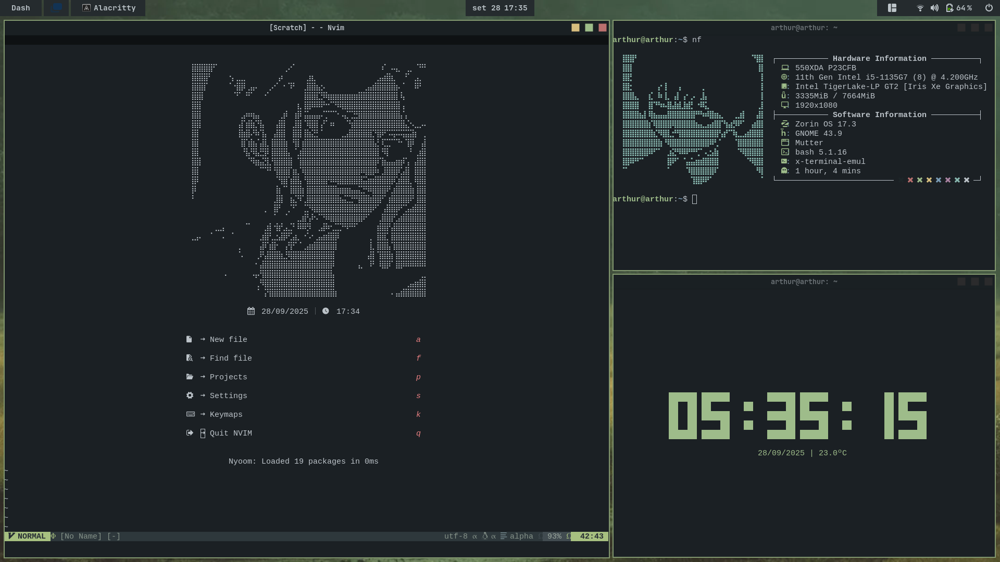

 <h1>Dotfiles</h1>
 
Dotfiles and resources I used to rice my ZorinOS <b>[GNOME/Xorg]<b>

 <h1>Showcase</h1>

 
 
 
 
 

 <h1>Extensions</h1>

- [Blur my Shell](https://extensions.gnome.org/extension/3193/blur-my-shell/) (For translucent effect)

- [Rounded Window Corners](https://extensions.gnome.org/extension/5237/rounded-window-corners/) (For rounded corners and colorized borders)

- [Aylur's Widgets](https://extensions.gnome.org/extension/5338/aylurs-widgets/) (GNOME custom widgets)

- [Tiling Shell](https://extensions.gnome.org/extension/7065/tiling-shell/) (For windows management)

 <h1>Themes and Cursors, Fonts and Terminal Colors</h1>

### Themes

- [Squared](https://www.gnome-look.org/p/2206255) (Theme and icons)

- [Catppuccin Mocha Cursors](https://www.gnome-look.org/p/2135236) (Custom cursor - Color Green)

- [Terminal Colors](https://github.com/arthur-dnts/dotfiles/blob/main/images/color_scheme.png) (Base16)

### Fonts

- [Nerd Fonts](https://www.nerdfonts.com/) (For terminal and NeoVim)

- [JetBrains Mono](https://www.jetbrains.com/lp/mono/) (For system-wide)

 <h1>IDEs</h1>

- [Visual Studio Code](https://code.visualstudio.com/) (Most used IDE)

- [NeoVim](https://neovim.io/) (For self-torture sometimes)

- [Lazy.nvim](https://github.com/folke/lazy.nvim) (For plugins management)

### NeoVim Plugins

- [Alpha.nvim](https://github.com/goolord/alpha-nvim) (Customized dashboard)

- [Nvim-Autopairs](https://github.com/windwp/nvim-autopairs) (Brackets autopairs)

- [Bufferline.nvim](https://github.com/akinsho/bufferline.nvim) (Tabpage integration)

- [Nvim-cmp](https://github.com/hrsh7th/nvim-cmp) (Code completion)

- [Everforest-nvim](https://github.com/neanias/everforest-nvim) (Theme)

- [Lualine.nvim](https://github.com/nvim-lualine/lualine.nvim) (Status line)

- [LuaSnip](https://github.com/L3MON4D3/LuaSnip) (Code snippets)

- [Telescope.nvim](https://github.com/nvim-telescope/telescope.nvim) (File and folder finder)

- [Tree.nvim](https://github.com/nvim-tree/nvim-tree.lua) (File explorer)

- [Nvim-Treesitter](https://github.com/nvim-treesitter/nvim-treesitter) (Syntax highlighting and code parsing)

 <h1>CLI/TUI Programs</h1>

- [ClockTemp](https://github.com/arthur-dnts/ClockTemp) (Display time, date and temperature)

- [Neofetch](https://github.com/dylanaraps/neofetch) (Display system information)

- [Btop](https://github.com/aristocratos/btop) (Resource monitor)

- [Cava](https://github.com/karlstav/cava) (Audio visualizer)

- [Cbonsai](https://github.com/mhzawadi/homebrew-cbonsai) (Bonsai tree generator)

- [Cmatrix](https://github.com/abishekvashok/cmatrix) (Matrix terminal)

- [Rofi](https://github.com/davatorium/rofi) (Programs launcher)

 <h1>License</h1>
 
This project is licensed under the MIT License. See the LICENSE file for details.

