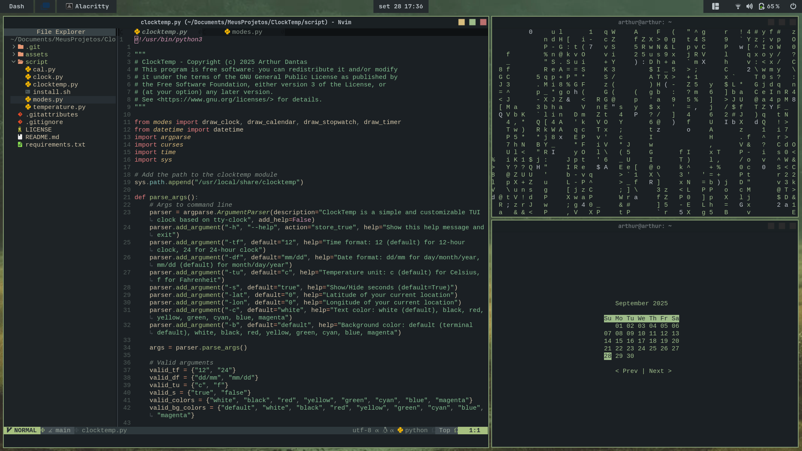
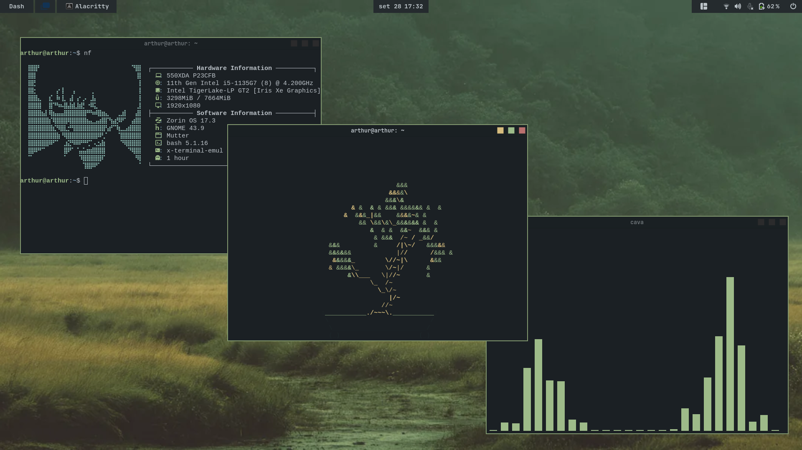

 <h1>Dotfiles</h1>
 
Dotfiles and resources I used to rice my ZorinOS

 <h1>Showcase</h1>

 
 
 
 
 

 <h1>Extensions</h1>

- [Blur my Shell](https://extensions.gnome.org/extension/3193/blur-my-shell/) (For translucent effect)

- [Rounded Window Corners](https://extensions.gnome.org/extension/5237/rounded-window-corners/) (For roundend corners and colorized borders)

- [Aylur's Widgets](https://extensions.gnome.org/extension/5338/aylurs-widgets/) (GNOME custom widgets)

- [Tiling Shell](https://extensions.gnome.org/extension/7065/tiling-shell/) (For windows management)

 <h1>Themes and Cursors, Fonts and Terminal Colors</h1>

### Themes

- [Nordic](https://www.gnome-look.org/p/1267246) (Theme and icons - Nordic Darker)

- [Catppuccin Mocha Cursors](https://www.gnome-look.org/p/2135236) (Custom cursor - Color blue)

- [Oxocarbon](https://github.com/nyoom-engineering/base16-oxocarbon) (Base16 terminal colors)

### Fonts

- [Nerd Fonts](https://www.nerdfonts.com/) (For terminal and NeoVim)

- [JetBrains Mono](https://www.jetbrains.com/lp/mono/) (For system-wide)

 <h1>NeoVim</h1>

> [!NOTE]
I use NvChad (yes, I'm a failure as a programmer) and Lazy.nvim for plugins management, all my custom configurations are in the `.config/nvim` folder.

- [NvChad](https://nvchad.com/) (For self-torture sometimes)

- [Lazy.nvim](https://github.com/folke/lazy.nvim) (For plugins management)

 <h1>CLI/TUI Programs</h1>

- [ClockTemp](https://github.com/dantas-arthur/ClockTemp) (Display time, date and temperature)

- [Neofetch](https://github.com/dylanaraps/neofetch) (Display system information)

- [Btop](https://github.com/aristocratos/btop) (Resources monitor)

- [Cava](https://github.com/karlstav) (Audio visualizer)

- [Cbonsai](https://github.com/mhzawadi/homebrew-cbonsai) (Bonsai tree generator)

- [Cmatrix](https://github.com/abishekvashok/cmatrix) (Matrix terminal)

 <h1>License</h1>
 
This project as a whole is licensed under the MIT License. See the LICENSE file for details.

